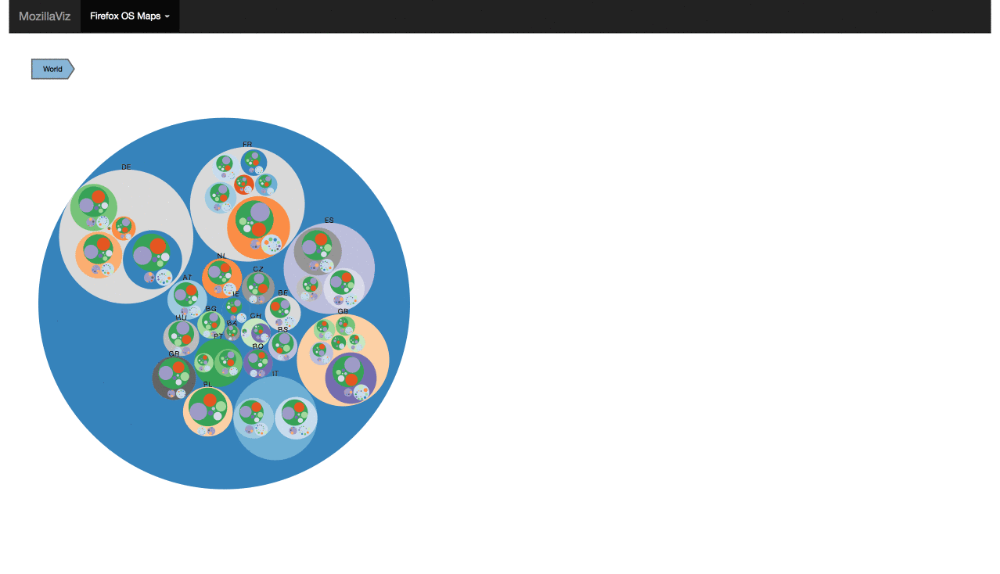

# MozillaViz
By Connor Ameres (cameres@usfca.edu), Andre Duarte (aguimaraesduarte@usfca.edu)

This app allows for a visualization of Firefox usage in cities in Europe.

## Description of the data set

The data was collected from Mozilla's internal tables, using a custom script in Spark. The data is anonymized and grouped so that there are no privacy issues of uniquely identifying profiles. There are two json files that we use to plot our data.

### Firefox version distribution on a map

The file `main_cities_size.json` contains monthly aggregated, usage data for select cities in Europe. For each city, the relative proportion of users in that city versus everywhere else is used to define the radius of the pie charts on the map and the relative proportions of Firefox versions within that city is used to build the arc lengths for each version. In order to accomplish this task we used D3.js and integrated back into Shiny in order to include it with the other visualizations, because we could not find an R package that accomplished our vision for this visualization.

The user can interact and explore the map visualization in the following ways. The size of the pie charts shows the "importance" of each city by number of monthly users. In addition, the user can hover on a pie chart to easily get quantified information about the selected city. The user can also zoom in and out of the visualization which would allow the addition of more cities in the future.

### Firefox Operating Systems hierarchical distribution

The file `os2.json` contains monthly aggregated data for select cities in Europe concerning the distribution of OS versions. For each city, we have the main OS (Windows_NT, Darwin, Linux), the minor OS version, and the count of occurrences.

Using a D3.js library in R (D3PartitionR), we are able to create several hierarchical plots to visualize this data: a circle tree map, a sunburst map, a partition chart, a tree map, and a collapsible tree. The user can hover and/or click through the data and explore the sub-partitions of the data within each country, city, and OS.

## Discussion

Since part of this project (the map) was built in D3, and the other (the hierarchical distribution) in Shiny (albeit using a D3 wrapper library), it has proven difficult to successfully integrate both into a single Shiny app that works as expected. We currently have a solution that works, but was painstaking to find. Ideally in the future the visualizations would be broken out into seperate applications.

Another difficulty, on both parts of the project, was to integrate a time selector. In both cases, this would cause the entire visualization to stop responding and had to be dropped. However, the overall look of the project is very similar to what we had envisioned.
