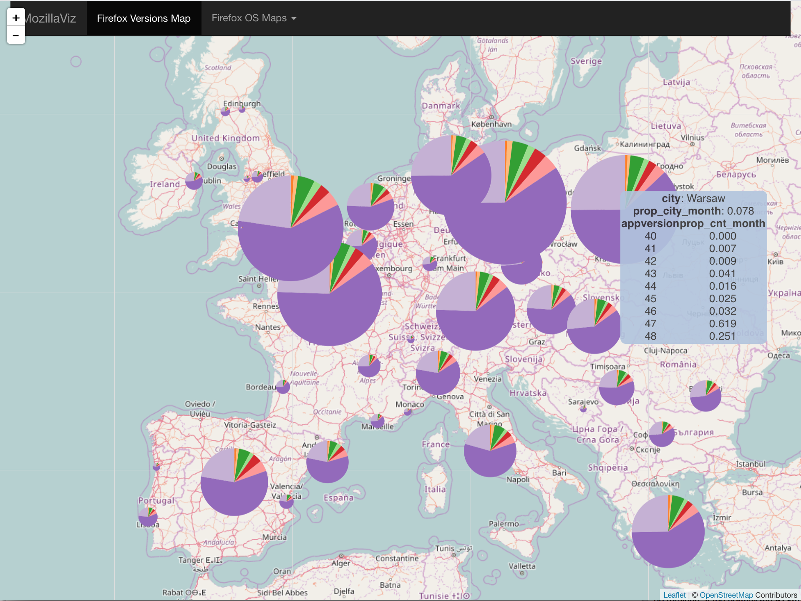
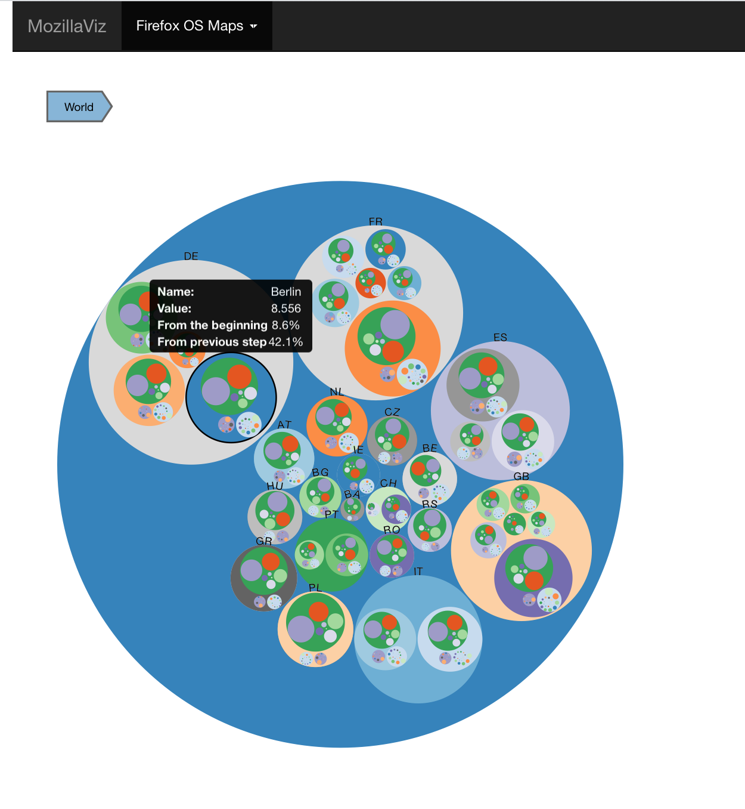
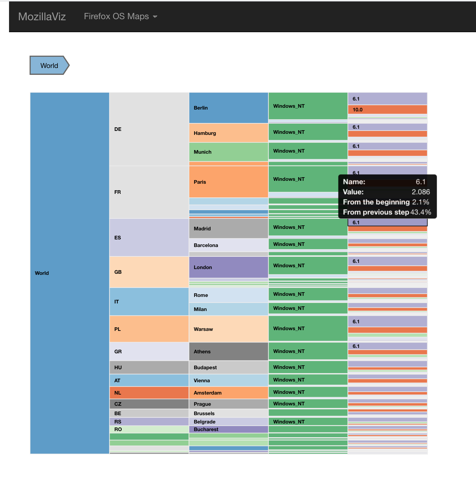
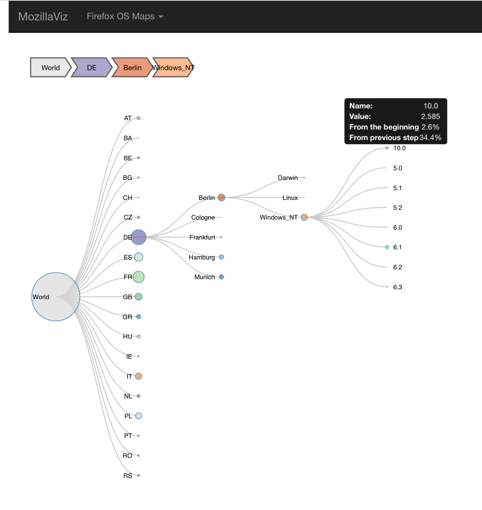

# MozillaViz

This app allows for a visualization of Firefox data in select cities in Europe.

## Description of the data set

The data was collected from Mozilla's internal tables, using a custom script in Spark. The data is anonymized and grouped so that there are no privacy issues of uniquely identifying profiles. There are two json files that we use to plot our data.

### main_cities_size.json

This file contains monthly aggregated data for select cities in Europe concerning the distribution of Firefox versions. For each city, we have the latitude and longitude to plot in the map, the relative proportion of users in that city versus everywhere else to define the size of the point in the map, and the relative proportions of Firefox versions within that city to build the pie charts.

Using D3.js (which we put back into Shiny in order to include it with the other visualizations), we use the above data to create pie charts with Firefox version distributions for each city and place them correspondingly on an interactive map. The size of the pie charts shows the "importance" of each city by number of monthly users. In addition, the user can hover on a pie chart to easily get quantified information about the selected city.

### os2.json

This file contains monthly aggregated data for select cities in Europe concerning the distribution of OS versions. For each city, we have the main OS (Windows_NT, Darwin, Linux), the minor OS version, and the count of occurrences.

Using a D3.js library in R (D3PartitionR), we are able to create several hierarchical plots to visualize this data: a circle tree map, a sunburst map, a partition chart, a tree map, and a collapsible tree. The user can hover and/or click through the data and explore the sub-partitions of the data within each country, city, and OS.

